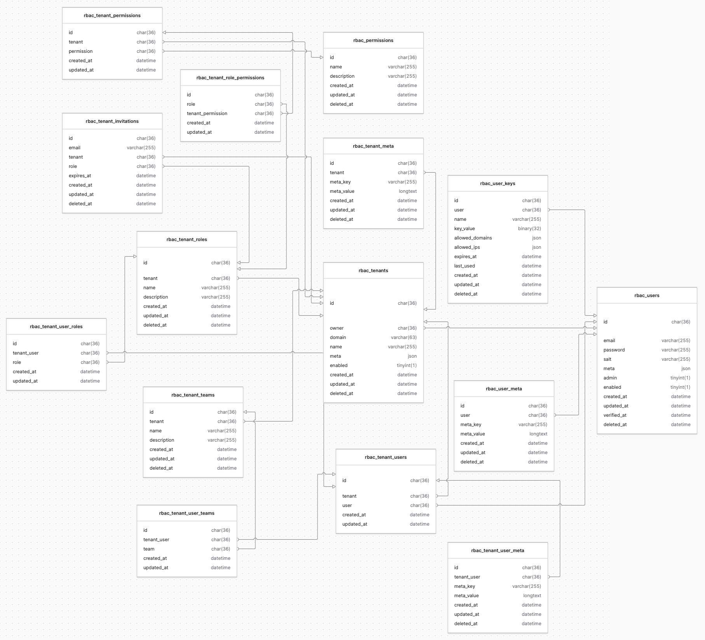

# [RBAC service](README.md) > Initial setup

- [Configuration](#configuration)
- [Add to container](#add-to-container)
- [Database migration and seeding](#database-migration-and-seeding)
- [Table diagram](#table-diagram)
- [Scheduled jobs](#scheduled-jobs)

## Configuration

This service requires a configuration array.
Typically, this would be placed at `config/rbac.php`.

**Example:**

```php
use Bayfront\Bones\Application\Utilities\App;

return [
    'table_prefix' => 'rbac_', // RBAC database table prefix
    'protected_prefix' => '_app-', // Protected column prefix
    'invitation_duration' => 10080, // Max tenant invitation duration (in minutes), 0 for unlimited: 10080 = 7 days
    'user' => [
        'require_verification' => true, // Require users to be verified to authenticate
        'key' => [
            'max_mins' => 525600, // Max user key duration (in minutes), 0 for unlimited: 525600 = 365 days
        ],
        'token' => [
            'revocable' => true, // Allow access tokens to be revocable? This requires a database query to validate each request
            'access_duration' => App::environment() == App::ENV_DEV ? 10080 : 15, // Access token duration (in minutes)
            'refresh_duration' => 10080, // Refresh token duration (in minutes): 10080 = 7 days
        ]
    ],
    'model' => [ // Override ORM service resource configuration per-model (optional)
        'permissions' => [
            'default_limit' => 100,
            'max_limit' => -1,
            'max_related_depth' => 3,
        ],
        'tenant_invitations' => [
            'default_limit' => 100,
            'max_limit' => -1,
            'max_related_depth' => 3,
        ],
        'tenant_meta' => [
            'default_limit' => 100,
            'max_limit' => -1,
            'max_related_depth' => 3,
        ],
         'tenant_permissions' => [
            'default_limit' => 100,
            'max_limit' => -1,
            'max_related_depth' => 3,
        ],
        'tenant_role_permissions' => [
            'default_limit' => 100,
            'max_limit' => -1,
            'max_related_depth' => 3,
        ],
        'tenant_roles' => [
            'default_limit' => 100,
            'max_limit' => -1,
            'max_related_depth' => 3,
        ],
        'tenants' => [
            'default_limit' => 100,
            'max_limit' => -1,
            'max_related_depth' => 3,
        ],
        'tenant_teams' => [
            'default_limit' => 100,
            'max_limit' => -1,
            'max_related_depth' => 3,
        ],
        'tenant_user_meta' => [
            'default_limit' => 100,
            'max_limit' => -1,
            'max_related_depth' => 3,
        ],
        'tenant_user_roles' => [
            'default_limit' => 100,
            'max_limit' => -1,
            'max_related_depth' => 3,
        ],
        'tenant_user_teams' => [
            'default_limit' => 100,
            'max_limit' => -1,
            'max_related_depth' => 3,
        ],
        'tenant_users' => [
            'default_limit' => 100,
            'max_limit' => -1,
            'max_related_depth' => 3,
        ],
        'user_keys' => [
            'default_limit' => 100,
            'max_limit' => -1,
            'max_related_depth' => 3,
        ],
        'user_meta' => [
            'default_limit' => 100,
            'max_limit' => -1,
            'max_related_depth' => 3,
        ],
        'users' => [
            'default_limit' => 100,
            'max_limit' => -1,
            'max_related_depth' => 3,
        ]
    ]
];
```

## Add to container

With the configuration completed, the [RbacService](rbacservice.md) class needs to be added to the Bones [service container](https://github.com/bayfrontmedia/bones/blob/master/docs/usage/container.md).
This is typically done in the `resources/bootstrap.php` file.
You may also wish to create an alias.

For more information, see [Bones bootstrap documentation](https://github.com/bayfrontmedia/bones/blob/master/docs/usage/bootstrap.md).

**NOTE:** The RBAC service requires the [ORM service](https://github.com/bayfrontmedia/bones-service-orm) to exist in the container.

By allowing the container to `make` the class during bootstrapping,
the RBAC service is available to be used in console commands:

```php
$rbacService = $container->make('Bayfront\BonesService\Rbac\RbacService', [
    'config' => (array)App::getConfig('rbac', [])
]);

$container->set('Bayfront\BonesService\Rbac\RbacService', $ormService);
$container->setAlias('rbacService', 'Bayfront\BonesService\Rbac\RbacService');
```

## Database migration and seeding

This library makes use of multiple database tables. 
The names of these tables are prefixed with the `table_prefix` [config value](#configuration).
To install, run a [migration](https://github.com/bayfrontmedia/bones/blob/master/docs/services/db.md#migrations) from the console:

```shell
php bones migrate:up
```

Initial database seeding with sample data can be done from the console:

```shell
php bones rbac:seed

# Force seeding (no input/confirmation required)
php bones rbac:seed --force
```

## Table diagram

[Diagram file](diagram/bones-service-rbac-v1.0.diagram)



## Scheduled jobs

To keep the database optimized, the following scheduled jobs are recommended:

- If user verification is required, delete unverified users using [deleteUnverified](models/users.md#deleteunverified).
- [Tenant invitations](models/tenantinvitations.md) and [user keys](models/userkeys.md) are both prunable by the `expires_at` field,
and should be pruned regularly.
- Delete any expired access and refresh tokens using [deleteExpiredTokens](models/usermeta.md#deleteexpiredtokens).
- Delete any expired TOTP's using [deleteExpiredUserVerifications](models/usermeta.md#deleteexpireduserverifications), [deleteExpiredPasswordRequests](models/usermeta.md#deleteexpiredpasswordrequests) and [deleteExpiredUserTotps](models/usermeta.md#deleteexpiredusertotps).
- Other soft-deleted resources may need to be permanently deleted using the [purgeTrashed](https://github.com/bayfrontmedia/bones-service-orm/blob/master/docs/traits/softdeletes.md#purgetrashed) method as needed.
